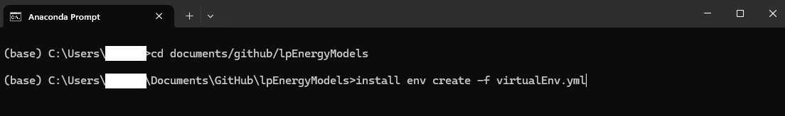

# Linear Energy System Models
---
Core repository for linear energy system models used in the course "Energy Economics of the Green Transition" at UCPH, 2025 version. 

The repository is set up with default instructions for a Github Copilot that will help you interact with code, adjust data, develop model extensions, and more. 

## Installation guide
All code is written in Python and only requires a few packages (see `virtualEnv.yml`). To make troubleshooting easier and maximize the utility we get out of the added copilot-instructions, we advice the following specific installation of Python + other programs:

* Install the Python distribution Anaconda (Miniconda and alike works, but some of the next steps have to be adjusted).
    * Unless you have a really good reason, use default installation including the suggested location. 
    * Add Python to path when asked in the installation (this makes it easier for Github Copilot to run tests).
* Install Github Desktop (other version control systems [e.g. Git] work, but some of the next steps have to be adjusted).
    * Unless you have a really good reason, use default installation including the suggested location.
* Install Visual Studio Code (Github copilot is best integrated here, but is also available in other IDEs like Visual Studio or JetBrains IDEs [e.g. pyCharm] via plugins).
    * Unless you have a really good reason, use default installation including the suggested location.
    * Once you have VS Code installed, you'll need to install several extensions. I suggest the following: Python, Pylance, Python Debugger, Python Environments, Jupyter, Jupyter Cell Tags, Jupyter Keymap, Jupyter Notebook Renderers, Github Copilot, Github Copilot Chat.
* Follow the steps [here](https://docs.github.com/en/education/about-github-education/github-education-for-students/apply-to-github-education-as-a-student) to get Github Education as a Student; this gives you free access to Github Copilot Pro.

Now that you have installed Anaconda, Github Desktop, VS Code, and set up a Github account (and probably awaiting confirmation from Github for access to Github Education), we can set up the parts:

**Clone repo:** Navigate to the course repository, find the `Code` tab and then `Open with Github Desktop`. Unless you have a really good reason, clone the folder to the *default suggested repository* and *do not change the name of the folder* (lpEnergyModels).

**Install virtual environment `lpEnergyModels`:** This creates a virtual environment to make sure that we are all working from the same Python configuration (makes troubleshooting much easier). 
* Open "Anaconda Prompt" ("Terminal" on Mac) and navigate to the folder where you have closed the repo using the `cd` command (see screendump below).
* Install virtual environment `lpEnergyModels` writing: `conda env create -f virtualEnv.yml` (see screendump below).

